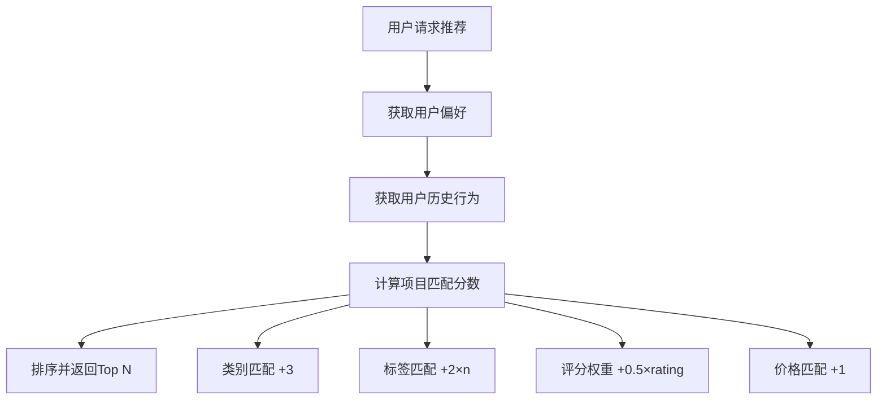

# 智能推荐系统 (MiniRec)

一个基于 TypeScript 开发的全栈智能推荐系统，支持景点、美食、酒店的个性化推荐。

## 🏗️ 项目架构

本项目采用**微服务架构**，包含三个主要服务：

```
recommendation-system/
├── frontend/          # React 前端应用
├── backend/           # Node.js + Express 后端服务  
├── ml-service/        # Python FastAPI 机器学习服务
└── start.bat         # 一键启动脚本
```

### 技术栈概览

| 服务层 | 技术选型 | 用途 |
|--------|----------|------|
| 前端 | React 18 + TypeScript + Tailwind CSS | 用户界面和交互 |
| 后端 | Node.js + Express + MongoDB + JWT | RESTful API 和业务逻辑 |
| 机器学习 | Python + FastAPI + Scikit-learn | 推荐算法和模型 |
| 数据库 | MongoDB | 数据存储和管理 |

## 🚀 核心功能

### 1. 用户系统
- **用户注册/登录**：基于 JWT 的身份认证
- **个人偏好设置**：支持类别和标签偏好配置
- **购买历史记录**：自动记录用户行为数据
- **浏览历史追踪**：为推荐算法提供数据支持

### 2. 推荐系统
- **个性化推荐**：基于用户偏好和历史行为
- **多维度筛选**：支持类别、价格、地区、标签筛选
- **实时搜索**：全文搜索支持名称、描述、标签
- **评分系统**：5星评分和用户评论

### 3. 内容管理
- **多分类支持**：景点、美食、酒店三大类别
- **丰富的元数据**：图片、位置、标签、详细信息
- **用户评价系统**：评分和评论功能
- **数据批量导入**：支持脚本批量添加内容

## 🛠️ 技术详解

### 前端架构 (React + TypeScript)

**核心技术栈：**
- React 19.1.1 + TypeScript 4.9.5
- Tailwind CSS 3.4.17（UI 样式）
- Axios（HTTP 客户端）
- React Router DOM（路由管理）

**组件结构：**
```typescript
src/
├── components/
│   ├── SearchBar.tsx      # 搜索组件
│   └── ImageGallery.tsx   # 图片展示组件
├── App.tsx               # 主应用组件
└── Home.tsx             # 首页组件
```

**核心特性：**
- 响应式设计，支持桌面和移动端
- 组件化开发，代码复用性高
- TypeScript 类型安全，减少运行时错误
- Tailwind CSS 快速样式开发

### 后端架构 (Node.js + Express)

**核心技术栈：**
- Node.js + Express 4.21.2
- MongoDB + Mongoose 7.8.7（数据持久化）
- JWT（JSON Web Token）身份认证
- bcryptjs（密码加密）
- CORS（跨域资源共享）

**API 设计：**
```typescript
// RESTful API 端点
GET    /api/items           # 获取项目列表（支持筛选）
GET    /api/items/:id       # 获取项目详情
POST   /api/items           # 创建项目（需认证）
POST   /api/items/:id/reviews  # 添加评论

POST   /api/users/register  # 用户注册
POST   /api/users/login     # 用户登录
PUT    /api/users/:id/preferences  # 更新用户偏好
POST   /api/users/:id/purchase     # 记录购买

GET    /api/recommendations/:userId  # 获取个性化推荐
```

**数据模型：**
```typescript
// 项目模型
interface IItem {
  category: 'attraction' | 'food' | 'hotel';
  name: string;
  description: string;
  images: string[];
  price: number;
  rating: number;
  location: { city: string; address: string; };
  tags: string[];
  reviews: Review[];
}

// 用户模型
interface IUser {
  username: string;
  email: string;
  password: string;  // bcrypt 加密
  preferences: {
    categories: string[];
    tags: string[];
    priceRange: number[];
  };
  purchaseHistory: Purchase[];
}
```

### 机器学习服务 (Python + FastAPI)

**核心技术栈：**
- FastAPI 0.104.0（异步 Web 框架）
- Scikit-learn 1.3.0（机器学习库）
- NumPy 1.24.3（数值计算）
- Pandas 2.0.3（数据处理）

**推荐算法：**
```python
class SimpleRecommendationModel:
    def predict(self, user_data, items, top_n=10):
        """基于多因子的推荐算法"""
        for item in items:
            score = 0
            # 类别匹配权重
            if item.category in user_categories:
                score += 3
            # 标签匹配权重  
            matching_tags = user_tags.intersection(item_tags)
            score += len(matching_tags) * 2
            # 评分权重
            score += item.rating * 0.5
            # 价格范围匹配
            if price_in_range(item.price):
                score += 1
        return top_scored_items
```

**API 端点：**
```python
POST /recommend        # 获取个性化推荐
POST /train           # 训练推荐模型
POST /user-data/import # 导入用户数据
GET  /health          # 健康检查
```

### 数据库设计 (MongoDB)

**集合结构：**
```javascript
// items 集合
{
  "_id": ObjectId,
  "category": "attraction|food|hotel",
  "name": "项目名称",
  "description": "详细描述", 
  "images": ["图片URL1", "图片URL2"],
  "price": 100,
  "rating": 4.5,
  "location": {
    "city": "城市",
    "address": "详细地址",
    "coordinates": [经度, 纬度]  // 支持地理索引
  },
  "tags": ["标签1", "标签2"],
  "reviews": [
    {
      "userId": "用户ID", 
      "userName": "用户名",
      "rating": 5,
      "comment": "评论内容",
      "date": ISODate
    }
  ],
  "createdAt": ISODate,
  "updatedAt": ISODate
}

// users 集合  
{
  "_id": ObjectId,
  "username": "用户名",
  "email": "邮箱",
  "password": "加密密码",
  "preferences": {
    "categories": ["attraction", "food"],
    "tags": ["文化", "历史"],
    "priceRange": [0, 500]
  },
  "purchaseHistory": [
    {
      "itemId": "项目ID",
      "itemName": "项目名称", 
      "category": "类别",
      "price": 100,
      "purchaseDate": ISODate
    }
  ]
}
```

## 🎯 推荐算法详解

### 推荐策略

本系统采用**混合推荐算法**，结合多种推荐方法：

1. **基于内容的过滤**
   - 根据用户偏好的类别和标签进行匹配
   - 权重：类别匹配 +3分，标签匹配每个 +2分

2. **协同过滤**  
   - 分析相似用户的购买历史
   - 推荐相似用户喜欢的项目

3. **基于评分的推荐**
   - 项目评分作为质量指标，评分越高推荐优先级越高
   - 权重：评分 × 0.5

4. **价格匹配**
   - 根据用户预算偏好筛选合适价格区间的项目
   - 价格匹配 +1分

### 推荐流程



## 📱 用户界面设计

### 页面结构

1. **首页**：展示推荐内容和分类浏览
2. **详情页**：项目详细信息、评价、购买
3. **个人中心**：偏好设置、历史记录
4. **搜索结果页**：搜索和筛选结果

### 交互特性

- **响应式布局**：适配桌面、平板、手机
- **实时搜索**：输入即搜索，无需点击
- **无限滚动**：流畅的内容浏览体验  
- **模态框设计**：登录、设置等操作
- **星级评分**：直观的评分显示

## 🔐 安全设计

### 身份认证
- **JWT Token**：无状态身份验证
- **密码加密**：bcryptjs 加密存储
- **Token 过期**：7天自动过期机制

### 数据安全
- **输入验证**：前后端双重验证
- **SQL 注入防护**：MongoDB ODM 参数化查询
- **CORS 配置**：跨域资源控制
- **敏感信息保护**：密码等敏感字段不返回给前端

## 🚀 部署架构

### 开发环境
```bash
# 1. 启动 MongoDB 服务
net start MongoDB

# 2. 启动后端服务 (端口 5000)
cd backend && npm run dev

# 3. 启动前端服务 (端口 3000)  
cd frontend && npm start

# 4. 启动机器学习服务 (端口 8000)
cd ml-service && uvicorn main:app --reload
```

### 生产环境建议
- **反向代理**：Nginx 负载均衡
- **容器化**：Docker + Docker Compose
- **数据库**：MongoDB 集群部署
- **缓存**：Redis 缓存热点数据
- **监控**：日志收集和性能监控

## 📊 性能优化

### 前端优化
- **代码分割**：React.lazy 按需加载
- **图片优化**：WebP 格式，懒加载
- **缓存策略**：浏览器缓存和 CDN

### 后端优化  
- **数据库索引**：地理位置索引，复合索引
- **查询优化**：分页查询，字段投影
- **连接池**：MongoDB 连接池管理
- **API 限流**：防止接口被恶意调用

### 推荐算法优化
- **离线计算**：预计算用户推荐结果
- **增量更新**：实时更新用户行为数据
- **缓存热门推荐**：缓存热门内容推荐
- **异步处理**：推荐计算异步化

## 🔧 开发工具

### 代码质量
- **TypeScript**：类型安全检查
- **ESLint**：代码规范检查  
- **Prettier**：代码格式化
- **Jest**：单元测试框架

### 开发效率
- **Nodemon**：后端热重载
- **React Hot Reload**：前端热更新
- **ts-node**：TypeScript 直接执行
- **Postman**：API 测试工具

## 🚀 快速开始

### 环境准备
1. **Node.js** >= 16.0.0
2. **Python** >= 3.8
3. **MongoDB** >= 4.4
4. **npm** 或 **yarn**

### 安装步骤

```bash
# 1. 克隆项目
git clone https://github.com/peter2317238492/minirec.git
cd recommendation-system

# 2. 安装后端依赖
cd backend
npm install

# 3. 安装前端依赖  
cd ../frontend
npm install

# 4. 安装机器学习服务依赖
cd ../ml-service
pip install -r requirements.txt

# 5. 启动所有服务
cd ..
start.bat  # Windows 系统
```

### 初始化数据

```bash
# 1. 创建环境配置文件
cd backend
cp .env.example .env

# 2. 初始化测试数据
npm run seed

# 3. 添加更多测试项目（可选）
npm run add-items
```

## 🔮 未来规划

### 功能扩展
- **实时聊天**：用户咨询和客服支持
- **社交功能**：用户关注、分享、评论互动
- **多语言支持**：国际化 i18n
- **移动端 APP**：React Native 开发

### 技术优化
- **微服务拆分**：按业务域进一步拆分服务
- **事件驱动架构**：消息队列异步处理
- **大数据支持**：Spark/Hadoop 处理海量数据
- **深度学习**：神经网络推荐算法

### 推荐算法升级
- **深度学习模型**：使用 TensorFlow/PyTorch
- **实时推荐**：流式计算推荐系统
- **多臂老虎机**：在线学习和探索
- **图神经网络**：基于知识图谱的推荐

---

## 📄 许可证

MIT License - 详见 [LICENSE](LICENSE) 文件

## 👥 贡献指南

欢迎提交 Issues 和 Pull Requests！

## 📞 联系方式

- 项目维护者：[peter2317238492](https://github.com/peter2317238492)
- 项目地址：[https://github.com/peter2317238492/minirec](https://github.com/peter2317238492/minirec)
