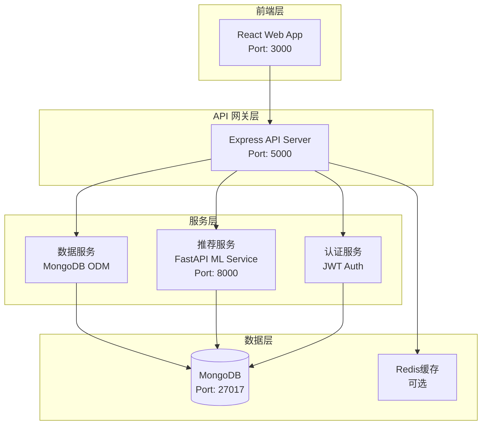
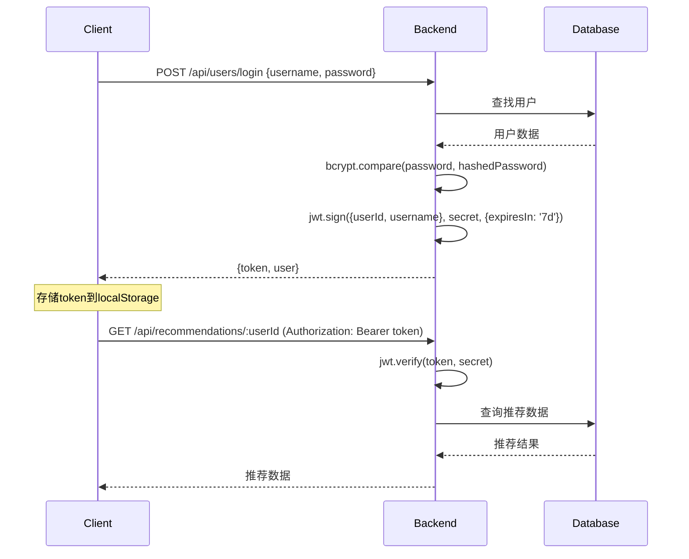

# 推荐系统技术规范文档

## 📋 项目概述

本文档详细描述了智能推荐系统的技术架构、实现细节和开发规范。

## 🏗️ 系统架构图



## 🛠️ 技术栈详细分析

### 前端技术栈

#### React 架构选择
- **版本**: React 19.1.1 (最新稳定版)
- **开发语言**: TypeScript 4.9.5
- **构建工具**: Create React App
- **包管理**: npm

#### UI 框架选择
- **样式框架**: Tailwind CSS 3.4.17
- **优势**: 原子化CSS，快速开发，包体积小
- **图标**: 内置 Heroicons SVG 图标

#### 状态管理策略
- **本地状态**: React Hooks (useState, useEffect)
- **全局状态**: Context API (未使用 Redux，保持轻量)
- **服务端状态**: 通过 Axios 直接管理

#### 路由设计
```typescript
// 路由结构
const routes = {
  '/': 'HomePage',           // 首页 - 推荐内容
  '/item/:id': 'ItemDetail', // 项目详情页
  '/login': 'LoginModal',     // 登录注册模态框
  '/preferences': 'PreferencesModal' // 偏好设置
}
```

### 后端技术栈

#### Node.js + Express 架构
```typescript
// 项目结构
src/
├── app.ts              // 应用入口，中间件配置
├── controllers/        // 业务逻辑控制器
│   ├── itemController.ts
│   └── userController.ts
├── models/            // 数据模型定义
│   ├── Item.ts
│   └── User.ts
├── routes/            // 路由定义
│   ├── itemRoutes.ts
│   ├── userRoutes.ts
│   └── recommendationRoutes.ts
├── middleware/        // 中间件
│   └── auth.ts
└── services/          // 业务服务
    └── recommendationService.ts
```

#### 数据库设计

**MongoDB 集合设计**:

```javascript
// 1. users 集合
{
  _id: ObjectId,
  username: String,         // 唯一用户名
  email: String,           // 邮箱地址
  password: String,        // bcrypt加密密码
  preferences: {
    categories: [String],   // 偏好类别 ['attraction','food','hotel']
    tags: [String],        // 偏好标签
    priceRange: [Number]   // 价格区间 [min, max]
  },
  purchaseHistory: [{
    itemId: ObjectId,      // 关联项目ID
    itemName: String,      // 项目名称(冗余，便于查询)
    category: String,      // 项目类别
    price: Number,         // 购买价格
    purchaseDate: Date     // 购买时间
  }],
  createdAt: Date,
  updatedAt: Date
}

// 2. items 集合
{
  _id: ObjectId,
  category: String,        // 'attraction'|'food'|'hotel'
  name: String,           // 项目名称
  description: String,    // 详细描述
  images: [String],       // 图片URL数组
  price: Number,          // 价格
  rating: Number,         // 平均评分 0-5
  location: {
    city: String,         // 城市
    address: String,      // 详细地址
    coordinates: [Number] // [经度,纬度] 支持地理查询
  },
  tags: [String],         // 标签数组
  details: Mixed,         // 额外详情(不同类型项目的特定信息)
  reviews: [{
    userId: String,       // 评论用户ID
    userName: String,     // 用户名
    rating: Number,       // 评分1-5
    comment: String,      // 评论内容
    date: Date           // 评论时间
  }],
  createdAt: Date,
  updatedAt: Date
}
```

**索引策略**:
```javascript
// 地理位置索引
db.items.createIndex({ "location.coordinates": "2dsphere" })

// 复合索引 - 类别和评分
db.items.createIndex({ category: 1, rating: -1 })

// 文本索引 - 支持全文搜索
db.items.createIndex({ 
  name: "text", 
  description: "text", 
  tags: "text" 
})

// 用户相关索引
db.users.createIndex({ email: 1 }, { unique: true })
db.users.createIndex({ username: 1 }, { unique: true })
```

### 机器学习服务架构

#### FastAPI 架构选择
```python
# 项目结构
ml-service/
├── main.py                 # FastAPI应用入口
├── requirements.txt        # Python依赖
├── models/                 # 机器学习模型
│   ├── recommendation_model.py
│   └── content_filter.py
├── services/               # 业务服务
│   ├── data_processor.py
│   └── model_trainer.py
└── utils/                  # 工具函数
    └── feature_extractor.py
```

#### 推荐算法实现

**1. 基于内容的过滤算法**
```python
class ContentBasedRecommender:
    def __init__(self):
        self.tfidf_vectorizer = TfidfVectorizer()
        
    def fit(self, items_data):
        # 构建项目特征向量
        descriptions = [item['description'] + ' '.join(item['tags']) 
                       for item in items_data]
        self.tfidf_matrix = self.tfidf_vectorizer.fit_transform(descriptions)
        
    def recommend(self, user_preferences, items, top_k=10):
        # 基于用户偏好计算相似度
        user_vector = self._create_user_vector(user_preferences)
        similarities = cosine_similarity(user_vector, self.tfidf_matrix)
        return self._get_top_recommendations(similarities, items, top_k)
```

**2. 协同过滤算法**
```python
class CollaborativeRecommender:
    def __init__(self):
        self.user_item_matrix = None
        self.user_similarity = None
        
    def fit(self, user_purchase_data):
        # 构建用户-项目评分矩阵
        self.user_item_matrix = self._build_matrix(user_purchase_data)
        # 计算用户相似度
        self.user_similarity = cosine_similarity(self.user_item_matrix)
        
    def recommend(self, user_id, top_k=10):
        # 基于相似用户的购买历史推荐
        similar_users = self._find_similar_users(user_id)
        return self._generate_recommendations(similar_users, top_k)
```

**3. 混合推荐策略**
```python
class HybridRecommender:
    def __init__(self, content_weight=0.6, collaborative_weight=0.4):
        self.content_recommender = ContentBasedRecommender()
        self.collaborative_recommender = CollaborativeRecommender()
        self.content_weight = content_weight
        self.collaborative_weight = collaborative_weight
        
    def recommend(self, user_data, items, top_k=10):
        # 获取两种算法的推荐结果
        content_scores = self.content_recommender.recommend(...)
        collaborative_scores = self.collaborative_recommender.recommend(...)
        
        # 加权合并结果
        final_scores = (content_scores * self.content_weight + 
                       collaborative_scores * self.collaborative_weight)
        
        return self._rank_and_return(final_scores, items, top_k)
```

## 🔐 安全架构设计

### 身份认证流程


### 数据安全措施

1. **密码安全**
```typescript
// 密码加密存储
import bcrypt from 'bcryptjs';

// 注册时加密
const saltRounds = 10;
const hashedPassword = await bcrypt.hash(password, saltRounds);

// 登录时验证
const isValid = await bcrypt.compare(password, user.password);
```

2. **JWT Token 配置**
```typescript
// JWT 配置
const tokenConfig = {
  expiresIn: '7d',          // 7天过期
  issuer: 'recommendation-system',
  audience: 'users'
};

// 中间件验证
const authMiddleware = (req, res, next) => {
  const token = req.headers.authorization?.split(' ')[1];
  if (!token) return res.status(401).json({message: '未授权'});
  
  try {
    const decoded = jwt.verify(token, process.env.JWT_SECRET);
    req.userId = decoded.userId;
    next();
  } catch (error) {
    return res.status(401).json({message: 'Token无效'});
  }
};
```

3. **输入验证**
```typescript
// 使用 express-validator 进行输入验证
const validateUser = [
  body('username').isLength({min: 3, max: 30}).matches(/^[a-zA-Z0-9_]+$/),
  body('email').isEmail().normalizeEmail(),
  body('password').isLength({min: 6}).matches(/^(?=.*[a-z])(?=.*[A-Z])(?=.*\d)/)
];
```

## 🚀 性能优化策略

### 前端性能优化

1. **代码分割**
```typescript
// 路由懒加载
import { lazy, Suspense } from 'react';

const ItemDetail = lazy(() => import('./components/ItemDetail'));

function App() {
  return (
    <Suspense fallback={<div>Loading...</div>}>
      <ItemDetail />
    </Suspense>
  );
}
```

2. **图片优化**
```typescript
// 图片懒加载组件
const LazyImage = ({ src, alt, className }) => {
  const [loaded, setLoaded] = useState(false);
  const [inView, setInView] = useState(false);
  
  useEffect(() => {
    const observer = new IntersectionObserver(
      ([entry]) => entry.isIntersecting && setInView(true),
      { threshold: 0.1 }
    );
    
    observer.observe(imgRef.current);
    return () => observer.disconnect();
  }, []);
  
  return inView ? (
     setLoaded(true)}
    />
  ) : (
    <div className={`${className} bg-gray-200`} />
  );
};
```

### 后端性能优化

1. **数据库查询优化**
```typescript
// 分页查询
const getItems = async (page = 1, limit = 20, filters = {}) => {
  const skip = (page - 1) * limit;
  
  return await Item.find(filters)
    .select('name price rating location.city images category tags')  // 字段投影
    .sort({ rating: -1, createdAt: -1 })
    .skip(skip)
    .limit(limit)
    .lean();  // 返回普通对象而非Mongoose文档
};

// 聚合查询示例
const getRecommendationStats = async () => {
  return await Item.aggregate([
    { $match: { rating: { $gte: 4.0 } } },
    { $group: { 
        _id: '$category', 
        avgPrice: { $avg: '$price' },
        count: { $sum: 1 }
      }
    },
    { $sort: { count: -1 } }
  ]);
};
```

2. **缓存策略**
```typescript
// Redis缓存示例 (可选)
import Redis from 'ioredis';
const redis = new Redis(process.env.REDIS_URL);

const getCachedItems = async (cacheKey, queryFn) => {
  // 尝试从缓存获取
  let cached = await redis.get(cacheKey);
  if (cached) return JSON.parse(cached);
  
  // 缓存未命中，查询数据库
  const data = await queryFn();
  
  // 缓存结果，5分钟过期
  await redis.setex(cacheKey, 300, JSON.stringify(data));
  return data;
};
```

### 推荐算法性能优化

1. **预计算推荐结果**
```python
# 离线计算用户推荐
class OfflineRecommendationService:
    def __init__(self):
        self.scheduler = BackgroundScheduler()
        
    def start_batch_computation(self):
        # 每小时计算一次推荐结果
        self.scheduler.add_job(
            func=self.compute_all_recommendations,
            trigger="interval",
            hours=1,
            id='batch_recommendation'
        )
        self.scheduler.start()
        
    async def compute_all_recommendations(self):
        users = await self.get_active_users()
        for user in users:
            recommendations = self.compute_user_recommendations(user)
            await self.cache_recommendations(user.id, recommendations)
```

2. **增量更新策略**
```python
# 实时更新用户行为对推荐的影响
class IncrementalUpdater:
    def update_user_behavior(self, user_id, action_type, item_id):
        # 更新用户画像
        self.update_user_profile(user_id, action_type, item_id)
        
        # 触发增量推荐计算
        if action_type in ['purchase', 'high_rating']:
            self.trigger_recommendation_update(user_id)
            
    def trigger_recommendation_update(self, user_id):
        # 异步更新推荐结果
        celery_app.send_task('update_user_recommendations', args=[user_id])
```

## 📊 监控和日志

### 应用监控
```typescript
// 自定义性能监控中间件
const performanceMonitor = (req, res, next) => {
  const start = Date.now();
  
  res.on('finish', () => {
    const duration = Date.now() - start;
    console.log({
      method: req.method,
      url: req.url,
      statusCode: res.statusCode,
      duration: `${duration}ms`,
      userAgent: req.get('User-Agent'),
      ip: req.ip
    });
    
    // 慢查询告警
    if (duration > 1000) {
      console.warn(`Slow request: ${req.method} ${req.url} took ${duration}ms`);
    }
  });
  
  next();
};
```

### 错误处理
```typescript
// 全局错误处理中间件
const errorHandler = (error, req, res, next) => {
  console.error({
    error: error.message,
    stack: error.stack,
    url: req.url,
    method: req.method,
    timestamp: new Date().toISOString()
  });
  
  // 生产环境不暴露错误详情
  const message = process.env.NODE_ENV === 'production' 
    ? '服务器内部错误' 
    : error.message;
    
  res.status(error.status || 500).json({
    success: false,
    message,
    ...(process.env.NODE_ENV !== 'production' && { stack: error.stack })
  });
};
```

## 🧪 测试策略

### 前端测试
```typescript
// Jest + React Testing Library
import { render, screen, fireEvent } from '@testing-library/react';
import ItemCard from '../ItemCard';

describe('ItemCard', () => {
  const mockItem = {
    _id: '1',
    name: '测试景点',
    category: 'attraction',
    price: 100,
    rating: 4.5,
    location: { city: '北京' },
    tags: ['文化', '历史']
  };
  
  test('should render item information correctly', () => {
    render(<ItemCard item={mockItem} onClick={jest.fn()} />);
    
    expect(screen.getByText('测试景点')).toBeInTheDocument();
    expect(screen.getByText('¥100')).toBeInTheDocument();
    expect(screen.getByText('北京')).toBeInTheDocument();
  });
  
  test('should call onClick when card is clicked', () => {
    const mockOnClick = jest.fn();
    render(<ItemCard item={mockItem} onClick={mockOnClick} />);
    
    fireEvent.click(screen.getByText('测试景点'));
    expect(mockOnClick).toHaveBeenCalledTimes(1);
  });
});
```

### 后端测试
```typescript
// Jest + Supertest
import request from 'supertest';
import app from '../app';
import User from '../models/User';

describe('User Authentication', () => {
  beforeEach(async () => {
    await User.deleteMany({});
  });
  
  describe('POST /api/users/register', () => {
    test('should register new user successfully', async () => {
      const userData = {
        username: 'testuser',
        email: 'test@example.com',
        password: 'password123'
      };
      
      const response = await request(app)
        .post('/api/users/register')
        .send(userData)
        .expect(201);
        
      expect(response.body.token).toBeDefined();
      expect(response.body.user.username).toBe(userData.username);
    });
    
    test('should not register user with existing email', async () => {
      // 创建已存在用户
      await User.create({
        username: 'existing',
        email: 'test@example.com',
        password: 'password123'
      });
      
      const response = await request(app)
        .post('/api/users/register')
        .send({
          username: 'newuser',
          email: 'test@example.com',
          password: 'password123'
        })
        .expect(400);
        
      expect(response.body.message).toContain('已存在');
    });
  });
});
```

## 🚀 部署指南

### Docker 容器化

**Dockerfile (后端)**:
```dockerfile
FROM node:18-alpine

WORKDIR /app

# 安装依赖
COPY package*.json ./
RUN npm ci --only=production

# 复制源代码
COPY . .

# 构建应用
RUN npm run build

# 暴露端口
EXPOSE 5000

# 启动应用
CMD ["npm", "start"]
```

**docker-compose.yml**:
```yaml
version: '3.8'

services:
  mongodb:
    image: mongo:6.0
    container_name: recommendation-db
    ports:
      - "27017:27017"
    volumes:
      - mongodb_data:/data/db
    environment:
      MONGO_INITDB_DATABASE: recommendation_system

  backend:
    build: ./backend
    container_name: recommendation-backend
    ports:
      - "5000:5000"
    depends_on:
      - mongodb
    environment:
      - NODE_ENV=production
      - MONGODB_URI=mongodb://mongodb:27017/recommendation_system
      - JWT_SECRET=${JWT_SECRET}
    volumes:
      - ./backend:/app
      - /app/node_modules

  frontend:
    build: ./frontend
    container_name: recommendation-frontend
    ports:
      - "3000:3000"
    depends_on:
      - backend
    environment:
      - REACT_APP_API_URL=http://localhost:5000

  ml-service:
    build: ./ml-service
    container_name: recommendation-ml
    ports:
      - "8000:8000"
    volumes:
      - ./ml-service:/app
    environment:
      - PYTHONPATH=/app

volumes:
  mongodb_data:
```

### 生产环境部署

**Nginx 配置**:
```nginx
server {
    listen 80;
    server_name your-domain.com;
    
    # 前端静态文件
    location / {
        root /var/www/recommendation-frontend/build;
        try_files $uri $uri/ /index.html;
    }
    
    # 后端API代理
    location /api/ {
        proxy_pass http://localhost:5000;
        proxy_http_version 1.1;
        proxy_set_header Upgrade $http_upgrade;
        proxy_set_header Connection 'upgrade';
        proxy_set_header Host $host;
        proxy_set_header X-Real-IP $remote_addr;
        proxy_set_header X-Forwarded-For $proxy_add_x_forwarded_for;
        proxy_set_header X-Forwarded-Proto $scheme;
        proxy_cache_bypass $http_upgrade;
    }
    
    # ML服务代理
    location /ml/ {
        proxy_pass http://localhost:8000/;
        proxy_set_header Host $host;
        proxy_set_header X-Real-IP $remote_addr;
    }
}
```

**PM2 进程管理**:
```json
{
  "apps": [
    {
      "name": "recommendation-backend",
      "script": "./dist/app.js",
      "cwd": "./backend",
      "instances": "max",
      "exec_mode": "cluster",
      "env": {
        "NODE_ENV": "production",
        "PORT": 5000
      },
      "log_file": "./logs/app.log",
      "error_file": "./logs/error.log",
      "out_file": "./logs/out.log"
    }
  ]
}
```

这份技术规范文档涵盖了推荐系统的详细技术实现，包括架构设计、安全措施、性能优化、测试策略和部署指南。开发者可以参考这份文档来理解系统的技术细节并进行进一步的开发和维护。
